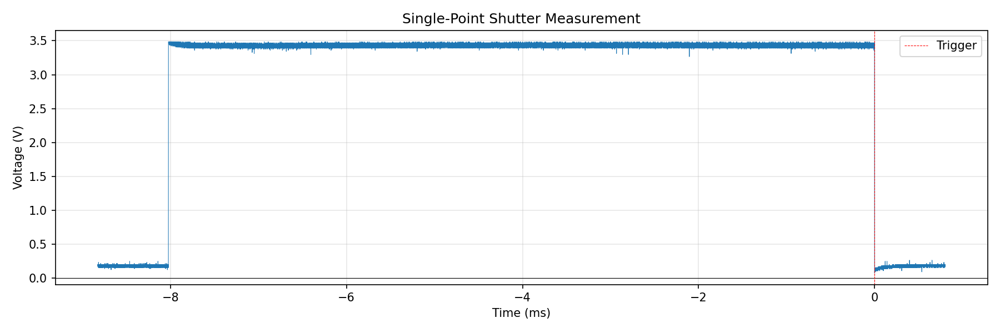
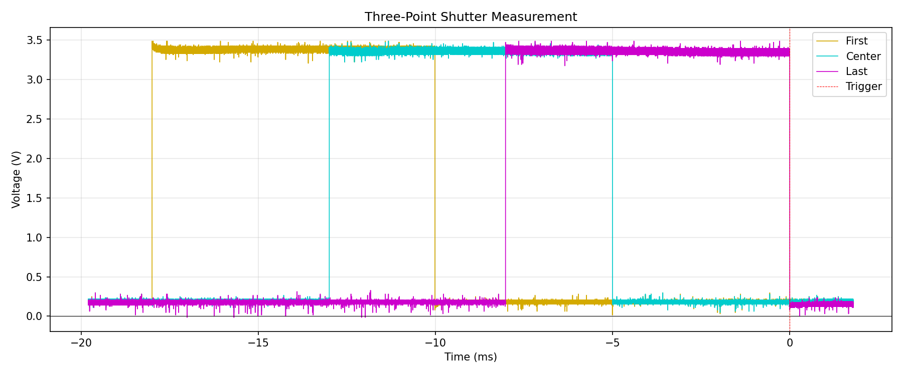

# ShutterScope

A camera shutter tester that uses an oscilloscope as the measurement device with photodiode sensors. It supports the Rigol DS1000Z range of oscilloscopes and connects via VISA to capture and analyze shutter timing data.

## Features

- **Single-point measurement**: Measure shutter speed at one point
- **Three-point measurement**: Measure shutter timing across the frame to calculate curtain travel time and velocity
- Automatic pulse detection and shutter speed calculation
- Outputs standard shutter speed fractions (1/125, 1/250, etc.)
- Saves waveform data as JSON and optional PNG plots

## Example Output

### Single-Point Measurement

```
$ uv run python -m shutterscope TCPIP::192.168.1.100::INSTR --plot

Connecting to TCPIP::192.168.1.100::INSTR...
Connected to oscilloscope
Configured oscilloscope (single-channel mode)
Press Ctrl+C to exit

Waiting for trigger...
Triggered! Downloading waveform...
Shutter speed: 8.12 ms (1/125)
Saved 9044 samples to captures/capture_2025-11-29T17:57:55.json
Saved plot to captures/capture_2025-11-29T17:57:55.png
```



### Three-Point Measurement

```
$ uv run python -m shutterscope TCPIP::192.168.1.100::INSTR --three-point --plot

Connecting to TCPIP::192.168.1.100::INSTR...
Connected to oscilloscope
Configured oscilloscope (3-channel mode, horizontal)
Press Ctrl+C to exit

Waiting for trigger...
Triggered! Downloading waveforms...

Three-Point Shutter Measurement (horizontal):
  First:  8.09 ms (1/125)
  Center: 8.09 ms (1/125)
  Last:   8.10 ms (1/125)

  Travel Time:      9073.0 µs
  First→Center:     4561.0 µs
  Center→Last:      4512.0 µs
  Curtain Velocity: 3.97 m/s
  Uniformity:       99.9%

Saved to captures/capture_2025-11-29T17:57:01.json
Saved plot to captures/capture_2025-11-29T17:57:01.png
```



## Setup

This project uses [uv](https://docs.astral.sh/uv/) for dependency management.

### Install uv

```bash
# macOS/Linux
curl -LsSf https://astral.sh/uv/install.sh | sh

# Or with Homebrew
brew install uv
```

### Install dependencies

```bash
uv sync
```

### Run the application

```bash
# Auto-discover oscilloscope via USB
uv run python -m shutterscope

# Connect via ethernet using VISA address
uv run python -m shutterscope TCPIP::192.168.1.100::INSTR

# Set custom trigger level (default 0.2V)
uv run python -m shutterscope --trigger-level 0.5

# Save a plot image for debugging
uv run python -m shutterscope --plot

# Show help
uv run python -m shutterscope --help
```

The application triggers on the falling edge of the signal, capturing the pulse that occurred before the trigger. The pulse is automatically detected and measured, with the waveform trimmed to just the pulse region for efficient storage.

### Development

```bash
uv run pytest       # Run tests
uv run mypy src     # Type check
uv run ruff check   # Lint
uv run ruff format  # Format
```
